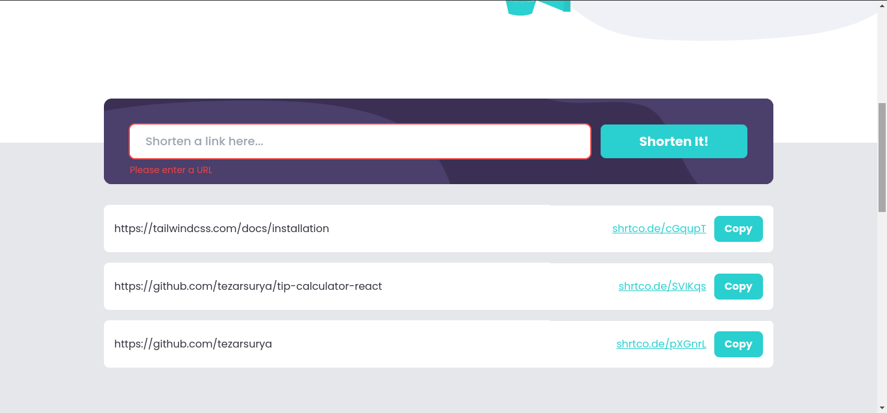
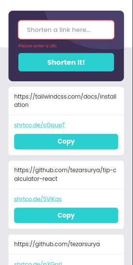

# Frontend Mentor - Shortly URL shortening API Challenge solution

This is a solution to the [Shortly URL shortening API Challenge challenge on Frontend Mentor](https://www.frontendmentor.io/challenges/url-shortening-api-landing-page-2ce3ob-G). Frontend Mentor challenges help you improve your coding skills by building realistic projects.

## Table of contents

- [Overview](#overview)
  - [The challenge](#the-challenge)
  - [Screenshot](#screenshot)
  - [Links](#links)
- [My process](#my-process)
  - [Built with](#built-with)
  - [What I learned](#what-i-learned)
- [Author](#author)

## Overview

### The challenge

Users should be able to:

- View the optimal layout for the site depending on their device's screen size
- Shorten any valid URL
- See a list of their shortened links, even after refreshing the browser
- Copy the shortened link to their clipboard in a single click
- Receive an error message when the `form` is submitted if:
  - The `input` field is empty

### Screenshot

### Links

- Solution URL: [My Solution](https://www.frontendmentor.io/solutions/url-shortening-api-landing-page-fo3m3PbALQ)
- Live Site URL: [url-shortener-nu-six.vercel.app](https://url-shortener-nu-six.vercel.app/)

## My process

### Built with

- CSS Grid
- Css Flexbox
- Mobile-first workflow
- [React](https://reactjs.org/) - JS library
- [Vite](https://vitejs.dev/) - Build tool
- [Tailwindcss](https://tailwindcss.com/) - CSS Framework
- [Jotai](https://jotai.org/) - State management library

### What I learned

I used CSS Grid a lot in this project. Now I understand how CSS Grid works.

## Author

- Frontend Mentor - [@tezarsurya](https://www.frontendmentor.io/profile/tezarsurya)
- Instagram - [@tezarsurya](https://www.instagram.com/tezarsurya)
